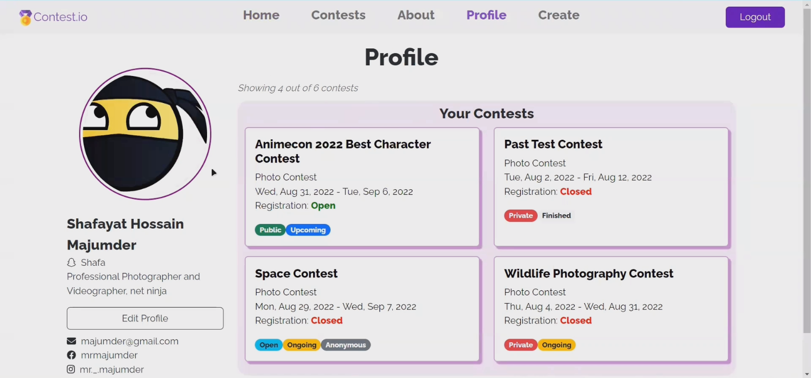

<a name="readme-top"></a>

<!-- PROJECT SHIELDS -->
[![Contributors][contributors-shield]][contributors-url]
[![Stargazers][stars-shield]][stars-url]
<!-- [![Youtube Link][youtube-shield]](https://youtu.be/LVSId1obOoE) -->


<!-- PROJECT LOGO -->
<br />
<div align="center">
  <a href="https://github.com/mrmajumder/contestIO">
    
  </a>

<h3 align="center">Contest.io: Online Contests Hosting Platform</h3>
  <p align="center">
    A Web-based Online Voting and Contest Hosting Solution
    <br />
    <br />
  </p>
</div>


<!-- TABLE OF CONTENTS -->
<details>
  <summary>Table of Contents</summary>
  <ol>
    <li>
      <a href="#about-the-project">About The Project</a>
      <ul>
        <li><a href="#built-with">Built With</a></li>
        <li><a href="#project-images">Project Images</a></li>
      </ul>
    </li>
    <li>
      <a href="#getting-started">Getting Started</a>
      <ul>
        <li><a href="#prerequisites">Prerequisites</a></li>
        <li><a href="#installation">Installation</a></li>
      </ul>
    </li>
    <li><a href="#contributors">Contributors</a></li>
  </ol>
</details>


<!-- ABOUT THE PROJECT -->
## About The Project

**Motivation**: Contest.io is a comprehensive platform designed for hosting contests and facilitating voting. With its user-friendly interface and robust features, it offers a seamless experience for hosts, voters, and participants. The platform supports various types of contests, including photo, video, audio, and polls, allowing for versatile settings. Security and privacy are prioritized, with features such as contest visibility controls for hosts, enabling public or private contests, and participant management. Additionally, voters can maintain their anonymity while casting votes. As an entirely web-based platform, Contest.io brings together all users in a unified and seamless environment.

See [Motivations](presentations/motivation.pptx) slide for more details.

This project is developed as a full-stack web application, following the MERN (MongoDB, Express, React, Node) stack. The project also went through an extensive design phase, and class and Entity Relationship diagrams were formed. These can be found in [this slide](presentations/class_ERD.pptx). Also, we designed the mock UI of the project in advance, a presentation on which can also be found [here](presentations/mockUI.pptx).

Developed for the "CSE408: Software Development" course.

<p align="right">(<a href="#readme-top">back to top</a>)</p>


### Built With

[](https://www.mongodb.com/)
[](https://expressjs.com/)
[![React][React.js]][React-url]
[](https://nodejs.org/en)
[](https://firebase.google.com/?gad=1)


<p align="right">(<a href="#readme-top">back to top</a>)</p>


### Project Images
<p float="left" align="middle">
  
  
   
  
   
   
</p>

<p align="right">(<a href="#readme-top">back to top</a>)</p>


<!-- GETTING STARTED -->
## Getting Started

This is an example of how to set up your project locally.
To get a local copy up and running follow these simple example steps.

### Prerequisites

This is an example of list of things you need to use the software and how to install them.
  ```sh
  node, react, express, mongoDB (can be online too, but can also be installed locally)
  ```


### Installation

1. Clone the repo
   ```sh
   git clone https://github.com/mrmajumder/contestIO.git
   ```
2. Install NPM packages for the `frontend`
   ```sh
   # move to frontend folder
   cd frontend

   npm install react-router-dom@6
   npm install react-datepicker
   npm install axios
   #for icons (cd to frontend and then run these commands)
   npm i --save @fortawesome/fontawesome-svg-core
   npm install --save @fortawesome/free-solid-svg-icons
   npm install --save @fortawesome/react-fontawesome
   npm install --save @fortawesome/free-brands-svg-icons
   #for cookies
   npm i universal-cookie -s
   ```
3. Install NPM packages for the `backend`
   ```sh
   # move to backend folder
   cd backend

   npm install express cors mongoose dotenv
   npm install -g nodemon
   Set-ExecutionPolicy RemoteSigned #(in terminal as administrator)
   npm install multer
   npm install nanoid
   npm install path
   # for authentication 
   npm i jsonwebtoken -s
   ```
4. To run, go to frontend and backend folder consecutively and run `npm start`

For connecting your own `MongoDB` database, do the following:
1. first, add a new user to the `security>database access` tab in MongoDB Atlas
2. in the `.env` file, change the `username` and `password` to your new user's username and password.
3. if connection closed error -> add `0.0.0.0/0` to the `security>network access` tab of MongoDB Atlas

For connecting your own `Firebase` database, do the following:
1. Go to the `frontend` directory 
    ```sh
    cd frontend/contestio/
    ```
2. Add firebase with your own userid `uuid`
    ```sh
    yarn add firebase uuid
    ```
3. Install necessary NPM packages
    ```sh
    npm install compressorjs
    npm install react-photo-view
    ```

<p align="right">(<a href="#readme-top">back to top</a>)</p>


<!-- CONTRIBUTING -->
## Contributors

* Shafayat Hossain Majumder - [GitHub][github-url] | [LinkedIn][linkedin-url] | [Mail][email] | [Website][website-url]
* Sourov Jajodia - [GitHub](https://github.com/Sourov72) | [LinkedIn](https://www.linkedin.com/in/sourov72) | [Mail](mailto:sourov.jajodia72@gmail.com) | [Website](https://sourov72.github.io)
* Md. Kamrujjaman - [GitHub](https://github.com/kamrul-s) | [LinkedIn](https://www.linkedin.com/in/md-kamrujjaman-085a74194/)


<p align="right">(<a href="#readme-top">back to top</a>)</p>


<!-- MARKDOWN LINKS & IMAGES -->
<!-- https://www.markdownguide.org/basic-syntax/#reference-style-links -->
[contributors-shield]: https://img.shields.io/github/contributors/mrmajumder/contestIO.svg?style=for-the-badge
[contributors-url]: https://github.com/mrmajumder/contestIO/graphs/contributors
[forks-shield]: https://img.shields.io/github/forks/mrmajumder/contestIO.svg?style=for-the-badge
[forks-url]: https://github.com/mrmajumder/contestIO/network/members
[stars-shield]: https://img.shields.io/github/stars/mrmajumder/contestIO.svg?style=for-the-badge
[stars-url]: https://github.com/mrmajumder/contestIO/stargazers
[issues-shield]: https://img.shields.io/github/issues/mrmajumder/contestIO.svg?style=for-the-badge
[issues-url]: https://github.com/mrmajumder/contestIO/issues
[license-shield]: https://img.shields.io/github/license/mrmajumder/contestIO.svg?style=for-the-badge
[license-url]: https://github.com/mrmajumder/contestIO/blob/master/LICENSE.txt
[linkedin-shield]: https://img.shields.io/badge/-LinkedIn-black.svg?style=for-the-badge&logo=linkedin&colorB=555
[linkedin-url]: https://linkedin.com/in/monsieurmajumder
[youtube-shield]: https://img.shields.io/badge/Video%20Demo-FF0000?style=for-the-badge&logo=youtube&logoColor=white
[github-url]: https://github.com/MrMajumder/
[email]: mailto:monsieurmajumder@gmail.com
[website-url]: https://mrmajumder.github.io/

[product-screenshot]: images/screenshot.png
[Next.js]: https://img.shields.io/badge/next.js-000000?style=for-the-badge&logo=nextdotjs&logoColor=white
[Next-url]: https://nextjs.org/
[React.js]: https://img.shields.io/badge/React-20232A?style=for-the-badge&logo=react&logoColor=61DAFB
[React-url]: https://reactjs.org/
[Vue.js]: https://img.shields.io/badge/Vue.js-35495E?style=for-the-badge&logo=vuedotjs&logoColor=4FC08D
[Vue-url]: https://vuejs.org/
[Angular.io]: https://img.shields.io/badge/Angular-DD0031?style=for-the-badge&logo=angular&logoColor=white
[Angular-url]: https://angular.io/
[Svelte.dev]: https://img.shields.io/badge/Svelte-4A4A55?style=for-the-badge&logo=svelte&logoColor=FF3E00
[Svelte-url]: https://svelte.dev/
[Laravel.com]: https://img.shields.io/badge/Laravel-FF2D20?style=for-the-badge&logo=laravel&logoColor=white
[Laravel-url]: https://laravel.com
[Bootstrap.com]: https://img.shields.io/badge/Bootstrap-563D7C?style=for-the-badge&logo=bootstrap&logoColor=white
[Bootstrap-url]: https://getbootstrap.com
[JQuery.com]: https://img.shields.io/badge/jQuery-0769AD?style=for-the-badge&logo=jquery&logoColor=white
[JQuery-url]: https://jquery.com 
